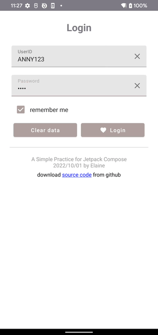
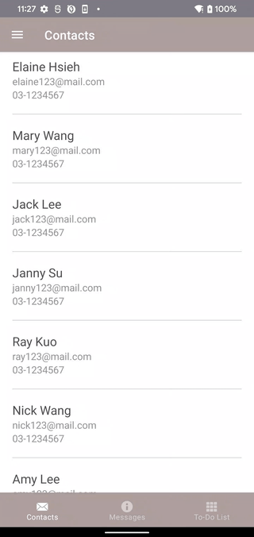
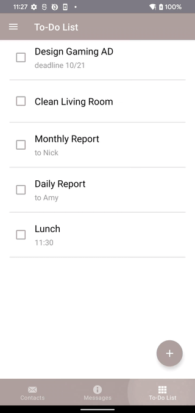

## Tech

* [Kotlin](https://kotlinlang.org/) 100% coverage
* [Hilt](https://developer.android.com/training/dependency-injection/hilt-jetpack) for dependency injection
* [Jetpack](https://developer.android.com/jetpack)
    * [Compose](https://developer.android.com/jetpack/compose) 
    * [Navigation](https://developer.android.com/topic/libraries/architecture/navigation/) for navigation between composables
    * [ViewModel](https://developer.android.com/topic/libraries/architecture/viewmodel) that stores, exposes and manages UI state
* [Moshi](https://github.com/square/moshi) parse JSON into Kotlin classes
* Implementation of [Multi Floating Action Button.kt](https://github.com/winniecake/example-mvvm-compose/blob/master/app/src/main/java/com/capital/composesample/ui/view/MultiFloatingActionButton.kt)

    
